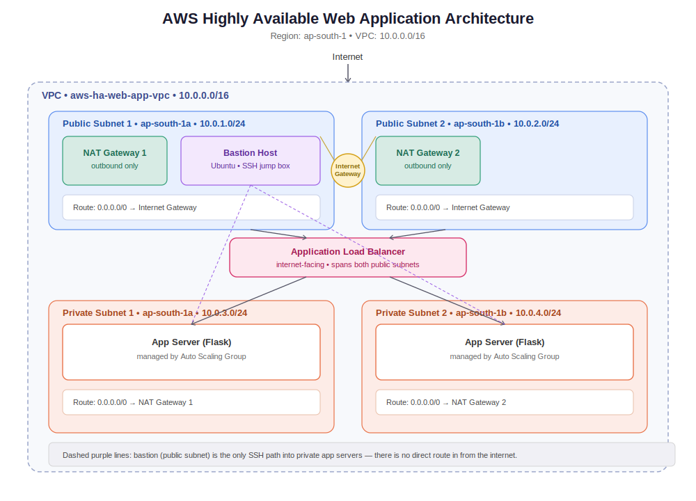

# AWS Highly Available Web Application

## Overview
This project implements a production-style, highly available web application architecture on AWS, built two ways: first entirely through the AWS Console (no Terraform/IaC), and second entirely through the AWS CLI (see `cli-scripts/`) — to demonstrate hands-on understanding of core AWS networking and compute services from both an interactive and a scripted approach.

The architecture spans two Availability Zones for fault tolerance. Public subnets host NAT gateways and a bastion host for secure SSH access, while private subnets host the actual application servers — never exposed directly to the internet. An Application Load Balancer distributes incoming traffic across both zones, and an Auto Scaling Group ensures the application can scale horizontally based on load, with unhealthy instances automatically replaced.

A simple Flask application is deployed as the workload, allowing the load balancing behavior to be verified directly — each request shows which instance served it.

## Why this project
Most tutorials stop at "launch an EC2 instance." This project instead focuses on how production traffic is actually routed, secured, and scaled — the same patterns used in real AWS environments — while keeping the app itself intentionally simple so the infrastructure is the focus.

## Architecture

- **VPC** across 2 Availability Zones
- **Public subnets**: NAT Gateway (outbound internet for private instances), Bastion host (SSH access)
- **Private subnets**: Application servers running Flask, managed by an Auto Scaling Group
- **Application Load Balancer**: internet-facing, routes to healthy targets only
- **Security Groups**: least-privilege access between ALB, app servers, and bastion

## Tech stack
AWS VPC, EC2, Auto Scaling Groups, Application Load Balancer, NAT Gateway, Security Groups, Python (Flask)

## Two implementations, same architecture

| | Console build | CLI build |
|---|---|---|
| Location | root of this repo | `cli-scripts/` |
| Method | AWS Console, click-by-click | AWS CLI, scripted commands |
| Purpose | Prove the design works | Prove the design is reproducible as code |

See `cli-scripts/README.md` for CLI-specific notes, including a few things that
came up only in the CLI build (AMI lookup by codename, IPv4 vs IPv6 IP detection,
and stricter route table dependency ordering during teardown).

## How to reproduce (Console)

### Prerequisites
- AWS account with console access
- An EC2 key pair (create one in EC2 → Key Pairs if you don't have one)
- This repo cloned or forked

### Step 1 — Create the VPC
- VPC → Create VPC → VPC only
- CIDR block: `10.0.0.0/16`

### Step 2 — Create subnets (4 total, across 2 AZs)
| Subnet | AZ | CIDR |
|---|---|---|
| Public Subnet 1 | AZ-a | 10.0.1.0/24 |
| Public Subnet 2 | AZ-b | 10.0.2.0/24 |
| Private Subnet 1 | AZ-a | 10.0.3.0/24 |
| Private Subnet 2 | AZ-b | 10.0.4.0/24 |

### Step 3 — Create and attach an Internet Gateway
- VPC → Internet Gateways → Create → Attach to your VPC

### Step 4 — Create NAT Gateways (one per AZ)
- Allocate 2 Elastic IPs
- NAT Gateway 1 → Public Subnet 1 → Elastic IP 1
- NAT Gateway 2 → Public Subnet 2 → Elastic IP 2

### Step 5 — Configure route tables
- **Public route table**: `0.0.0.0/0` → Internet Gateway → associate both public subnets
- **Private route table 1**: `0.0.0.0/0` → NAT Gateway 1 → associate Private Subnet 1
- **Private route table 2**: `0.0.0.0/0` → NAT Gateway 2 → associate Private Subnet 2

### Step 6 — Create security groups
| Name | Inbound rule |
|---|---|
| alb-sg | HTTP 80 from 0.0.0.0/0 |
| app-sg | HTTP 80 from alb-sg; SSH 22 from bastion-sg |
| bastion-sg | SSH 22 from your IP only |

### Step 7 — Launch the bastion host
- EC2 → Launch instance → Ubuntu, t3.micro
- Subnet: Public Subnet 1, Security group: bastion-sg
- Assign your key pair

### Step 8 — Create a launch template for app servers
- EC2 → Launch Templates → Create
- AMI: Ubuntu, Instance type: t3.micro
- Security group: app-sg
- User data: paste contents of `scripts/user-data.sh`

### Step 9 — Create a target group
- EC2 → Target Groups → Create → Instance type target
- Protocol: HTTP, Port: 80
- Health check path: `/health`

### Step 10 — Create the Application Load Balancer
- EC2 → Load Balancers → Create → Application Load Balancer
- Internet-facing, select both public subnets
- Security group: alb-sg
- Listener: HTTP 80 → forward to target group from Step 9

### Step 11 — Create the Auto Scaling Group
- EC2 → Auto Scaling Groups → Create
- Use the launch template from Step 8
- VPC subnets: both private subnets
- Attach to existing target group from Step 9
- Desired/min/max: 2 / 2 / 4

### Step 12 — Verify
- Wait ~2–3 minutes for instances to pass health checks
- Copy the ALB's DNS name
- Open it in a browser — refresh a few times, the hostname should alternate between instances, confirming load balancing across AZs
- SSH into the bastion, then SSH from the bastion into a private instance's private IP to confirm the network path works

## How to reproduce (CLI)

See `cli-scripts/README.md` and `cli-scripts/build.sh` for the full scripted
equivalent of the 12 steps above.

## Troubleshooting notes (from actually building this)

- **Ubuntu's PEP 668 restriction blocks `pip3 install`.** Both the console and
  CLI builds hit `error: externally-managed-environment` when the user-data
  script ran `pip3 install flask`. Fixed by adding `--break-system-packages`
  to the pip install command in `scripts/user-data.sh`.
- **Security groups referencing other security groups need a new rule row,
  not an edit of an existing CIDR-based rule.** AWS returns "You may not
  specify a referenced group id for an existing IPv4 CIDR rule" if you try to
  change an existing rule's source type in place.
- **A "connection timed out" SSH attempt (vs. "connection refused") usually
  means a security group or route table issue, not a credentials issue.** In
  this build, it meant a missing SSH-from-bastion rule on `app-sg`.

## Cleanup

To avoid ongoing AWS charges, tear down resources in this order:

1. Delete the Auto Scaling Group (this terminates the app server instances)
2. Delete the Application Load Balancer
3. Delete the Target Group
4. Terminate the bastion host instance
5. Delete both NAT Gateways
6. Release both Elastic IPs
7. Disassociate subnets from route tables, then delete all 3 route tables
8. Detach and delete the Internet Gateway
9. Delete all 4 subnets
10. Delete the VPC
11. Delete the security groups (alb-sg, app-sg, bastion-sg)

**Estimated running cost if left up:** ~$70–80/month, primarily from the 2 NAT Gateways (~$65) and their Elastic IPs (~$7). Both the console and CLI versions were built, verified working, and torn down the same day to avoid ongoing cost.

## What I'd add for a full production setup
HTTPS via ACM, WAF, RDS (Multi-AZ) for persistent data, CloudWatch alarms + CloudTrail, CI/CD pipeline, Route 53 custom domain.